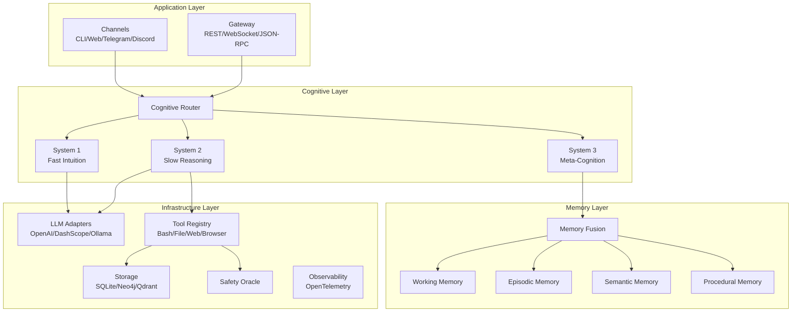
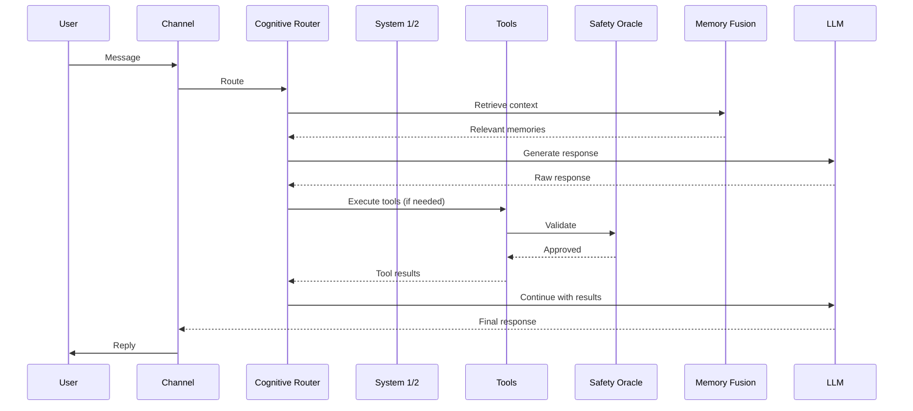

# :building_construction: Architecture

Crablet follows a modular, layered architecture built entirely in Rust on top of the Tokio async runtime.

## System Panorama

## Module Map

| Module | Path | Responsibility |
|:-------|:-----|:---------------|
| `channels` | `src/channels/` | Platform adapters (CLI, Web, Telegram, Discord) |
| `gateway` | `src/gateway/` | API gateway (REST, WebSocket, JSON-RPC) |
| `cognitive` | `src/cognitive/` | Three-layer cognition + routing + meta-controller |
| `memory` | `src/memory/` | Four-layer memory + fusion retrieval |
| `tools` | `src/tools/` | Built-in tool implementations |
| `skills` | `src/skills/` | Skill loader and executor |
| `knowledge` | `src/knowledge/` | RAG pipeline, vector/graph stores |
| `agent` | `src/agent/` | Multi-agent swarm + distributed harness |
| `config` | `src/config/` | Configuration management |
| `auth` | `src/auth/` | Authentication and authorization |
| `safety` | `src/safety/` | Safety oracle and policy enforcement |
| `observability` | `src/observability/` | Telemetry and metrics |
| `storage` | `src/storage/` | Database abstraction layer |
| `canvas` | `src/canvas/` | Visual workspace components |
| `scripting` | `src/scripting/` | Lua 5.4 scripting engine |
| `sandbox` | `src/sandbox/` | Docker sandbox execution |
| `workflow` | `src/workflow/` | Workflow engine |
| `rules` | `src/rules/` | Business rule engine |
| `audit` | `src/audit/` | Audit logging |
| `heartbeat` | `src/heartbeat/` | Health monitoring |
| `testing` | `src/testing/` | Testing utilities |
| `rpa` | `src/rpa/` | Robotic Process Automation |
| `gui` | `src/gui/` | Native GUI (experimental) |
| `evaluation` | `src/evaluation/` | Model evaluation framework |
| `telemetry` | `src/telemetry/` | Telemetry collection |
| `protocols` | `src/protocols/` | Communication protocols |
| `utils` | `src/utils/` | Shared utilities |

## Key Design Decisions

### Why Rust?

- **Zero-cost abstractions** — High-level ergonomics without runtime overhead
- **Fearless concurrency** — Tokio async runtime with compile-time safety
- **Small binaries** — Docker images < 20 MB
- **Fast startup** — < 500ms cold start

### Why Tokio?

- Industry-standard async runtime for Rust
- Supports 100+ concurrent agents efficiently
- Mature ecosystem with tracing, tower, hyper

### Why anyhow + thiserror?

- `anyhow` for application-level error propagation
- `thiserror` for library-level typed errors
- Consistent pattern across the entire codebase

## Data Flow

