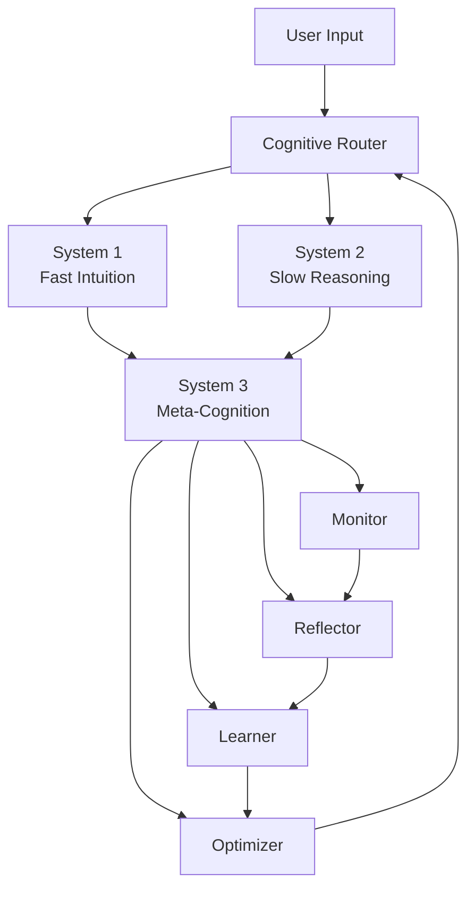

# :brain: Cognitive System

Crablet implements a novel three-layer cognitive architecture inspired by cognitive science, enabling the agent to think at different levels of depth and self-reflect on its own reasoning.

-   :zap: **System 1 — Fast Thinking**
    
    Rapid, intuitive responses for simple queries and routine tasks
    
    ---
    
    [:octicons-arrow-right-24: Three-Layer Architecture](three-layer.md)

-   :thought_balloon: **System 2 — Slow Reasoning**
    
    Deliberate, step-by-step reasoning for complex problems
    
    ---
    
    [:octicons-arrow-right-24: Three-Layer Architecture](three-layer.md)

-   :eye: **System 3 — Meta-Cognition**
    
    Self-monitoring, reflection, and continuous improvement
    
    ---
    
    [:octicons-arrow-right-24: Meta-Cognition](meta-cognition.md)

-   :chart_line: **Thought Visualization**
    
    Real-time rendering of cognitive processes in the Web UI
    
    ---
    
    [:octicons-arrow-right-24: Visualization](thought-visualization.md)

## Architecture Overview

## How It Works

1. **Input arrives** → Cognitive Router evaluates complexity
2. **Simple queries** → Route to System 1 for fast response
3. **Complex problems** → Route to System 2 for deliberate reasoning
4. **Low confidence or failure** → Trigger System 3 meta-reflection
5. **Meta-cognition cycle** → Monitor → Reflect → Learn → Optimize
6. **Strategy updates** → Feed back to Router for future decisions
