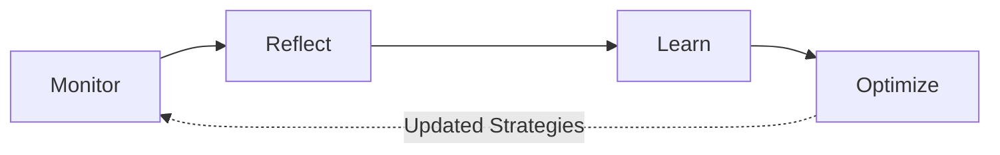

# :eye: Meta-Cognition

Crablet's System 3 implements a complete meta-cognitive loop: **Monitor → Reflect → Learn → Optimize**.

## The Meta-Cognitive Cycle



## Components

### Monitor

Collects real-time metrics during task execution:

| Metric | Description |
|:-------|:------------|
| Confidence score | Self-assessed certainty (0-1) |
| Quality score | Output quality rating |
| Resource usage | CPU, memory, token consumption |
| Latency | Response time breakdown |
| Success/failure | Task outcome tracking |

### Reflector

Diagnoses problems when things go wrong:

- **Problem Classification** — 5 types: timeout, hallucination, tool failure, context loss, ambiguity
- **Root Cause Analysis** — Uses LLM to analyze failure chains
- **Severity Assessment** — Low / Medium / High / Critical
- **Improvement Suggestions** — 6 action types: retry, rephrase, escalate, simplify, decompose, switch_model

### Learner

Extracts patterns from experience:

- **Task Patterns** — Recognizes recurring task structures
- **Error Patterns** — Learns common failure modes
- **Success Strategies** — Records what works well
- **Knowledge Base** — Accumulated wisdom grows over time

### Optimizer

Applies learned improvements:

- **Strategy Selection** — Picks the best approach for similar future tasks
- **Performance Tracking** — Monitors strategy effectiveness
- **Adaptive Tuning** — Adjusts parameters based on outcomes

## Usage

```rust
use crablet::cognitive::{MetaCognitiveController, ExecutionRequest};

// Create controller
let controller = MetaCognitiveController::new(llm).await?;

// Execute with meta-cognitive monitoring
let result = controller.execute_with_meta(request, |req| {
    // Your task execution logic
}).await;

// Retrieve statistics
let stats = controller.get_statistics().await;
println!("Total tasks: {}", stats.total_tasks);
println!("Patterns learned: {}", stats.patterns_extracted);
```

## Performance Overhead

| Operation | Overhead |
|:----------|:---------|
| Execution monitoring | < 1ms |
| Reflection analysis | < 100ms (with LLM) |
| Pattern extraction | < 50ms |
| Optimization application | < 10ms |
| Memory footprint | < 100MB |
