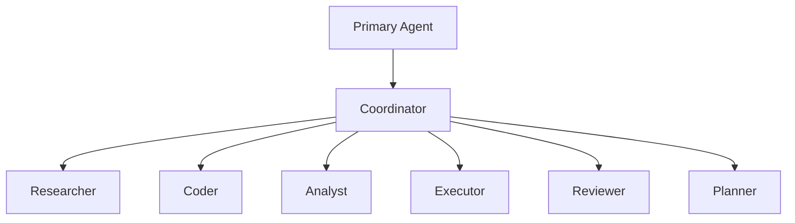

# :people_group: Delegation

Crablet supports spawning sub-agents for parallel task execution through its multi-agent swarm system.

## Architecture



## Role Presets

| Role | Specialty | Best For |
|:-----|:----------|:---------|
| **Researcher** | Information gathering | Literature review, fact-checking |
| **Coder** | Code generation | Writing, debugging, refactoring |
| **Analyst** | Data analysis | Charts, statistics, insights |
| **Executor** | Task execution | Running commands, deploying |
| **Reviewer** | Quality assurance | Code review, testing |
| **Planner** | Strategic planning | Breaking down complex tasks |

## Usage

```
You: Research the latest advances in RAG, then write a summary

🦀 Crablet: I'll delegate this to specialized agents.

[Spawning Researcher agent]
Researcher: Found 5 recent papers on RAG advances...

[Spawning Writer agent]
Writer: Based on the research, here's a comprehensive summary...
```

## Configuration

```toml
[delegation]
max_sub_agents = 10
default_role = "Researcher"
auto_delegate = true
context_sharing = "minimal"  # none | minimal | full
```

## Performance

Thanks to Rust's Tokio async runtime, Crablet can efficiently coordinate **100+ concurrent agents** with minimal overhead.
