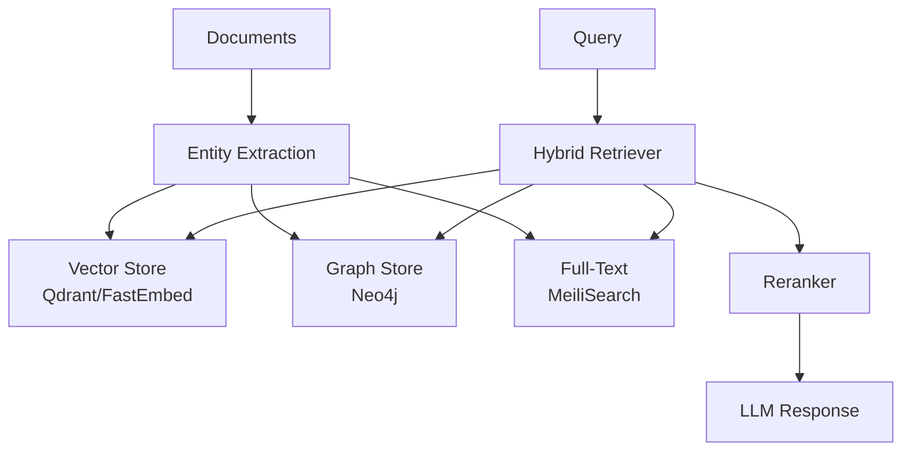

# :mag: Knowledge & RAG

Crablet includes a powerful knowledge management system with Retrieval-Augmented Generation (RAG) capabilities.

## Architecture



## Quick Start

```bash
# Extract knowledge from a document
crablet knowledge extract --file paper.pdf

# Query the knowledge base
crablet knowledge query "What is the attention mechanism?"

# Index an entire directory
crablet knowledge index --dir ./docs
```

## Storage Backends

| Backend | Purpose | Status |
|:--------|:--------|:-------:|
| **Qdrant** | Vector similarity search | :white_check_mark: |
| **Neo4j** | Graph relationships | :white_check_mark: |
| **MeiliSearch** | Full-text search | :white_check_mark: |
| **SQLite FTS5** | Lightweight full-text | :white_check_mark: |

## Entity Extraction Modes

Configure via `GRAPH_RAG_ENTITY_MODE`:

| Mode | Method | Speed | Accuracy |
|:-----|:-------|:------|:---------|
| `rule` | Pattern-based rules | :zap: Fast | Good for structured data |
| `phrase` | Phrase matching | :zap: Fast | Good for known entities |
| `hybrid` | Both combined | :hourglass: Moderate | :star: Best overall (default) |

## Hybrid Retrieval Strategy

Crablet combines multiple retrieval approaches for optimal results:

1. **Vector Search** — Semantic similarity via embeddings
2. **Graph Traversal** — Relationship-aware context expansion
3. **Full-Text Search** — Keyword precision
4. **Re-ranking** — Cross-encoder scoring for final ordering

## Configuration

```toml
[knowledge]
vector_store = "qdrant"           # qdrant | sqlite
graph_store = "neo4j"             # neo4j | disabled
fulltext_store = "meilisearch"    # meilisearch | sqlite_fts
entity_mode = "hybrid"            # rule | phrase | hybrid
chunk_size = 512
chunk_overlap = 64
top_k = 10
rerank_enabled = true
```
