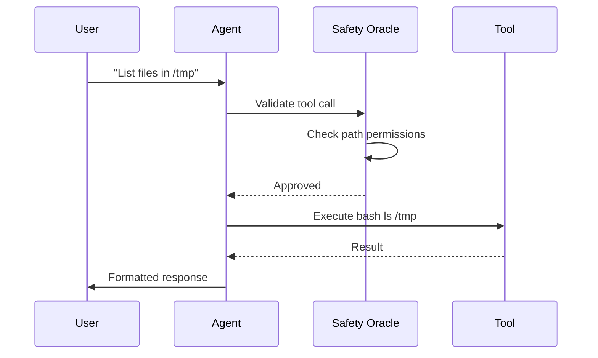

# :wrench: Tools

Crablet ships with a comprehensive set of built-in tools that the agent can invoke during conversations.

## Built-in Tools

| Tool | Description | Safety Level |
|:-----|:------------|:-------------|
| `bash` | Shell command execution | Requires approval in Strict mode |
| `file_read` | Read file contents | Path-restricted |
| `file_write` | Write/create files | Path-restricted |
| `web_search` | Search the web (Serper/DuckDuckGo) | Always allowed |
| `http` | Make HTTP requests | Domain-filtered |
| `vision` | Analyze images | Always allowed |
| `browser` | Headless browser automation | Requires approval |
| `calculator` | Mathematical computations | Always allowed |
| `weather` | Weather queries (OpenMeteo) | Always allowed |

## Tool Execution Flow



## MCP Support

Crablet fully supports the [Model Context Protocol](https://modelcontextprotocol.io) for connecting to external tool servers.

### Configure MCP Servers

```toml
# ~/.config/crablet/config.toml
[mcp_servers]
math_server = { command = "python3", args = ["mcp_server.py"] }
weather_server = { command = "node", args = ["weather-mcp.js"] }
remote_server = { url = "https://mcp.example.com/sse", headers = { Authorization = "Bearer xxx" } }
```

### Use MCP Tools

Once configured, MCP tools are automatically available to the agent:

```
You: Calculate the square root of 144

🦀 Crablet: [Calling MCP tool: math_server.sqrt]
The square root of 144 is 12.
```

## Disabling Tools

To disable specific tools:

```toml
[tools]
disabled = ["browser", "bash"]  # Disable browser and shell access
```
