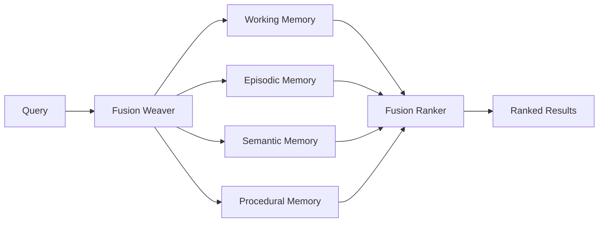

# :twisted_rightwards_arrows: Memory Fusion

Memory Fusion is Crablet's intelligent retrieval system that combines signals from all four memory layers to produce contextually relevant memories.

## Fusion Architecture



## Fusion Layers

The fusion system operates across three layers:

### Layer Soul (Deep Identity)

Core personality and long-term preferences that persist across all contexts.

### Layer User (Personal Context)

User-specific preferences, habits, and interaction patterns.

### Layer Session (Active Context)

Current conversation state, recent exchanges, and immediate goals.

## Retrieval Strategy

1. **Candidate Generation** — Each layer proposes candidate memories
2. **Scoring** — Weighted combination of relevance, recency, and importance
3. **Diversity** — Ensure varied perspectives (avoid echo chambers)
4. **Ranking** — Final ordering by composite score
5. **Injection** — Top-K memories injected into LLM context

## Configuration

```toml
[memory.fusion]
strategy = "weighted"  # weighted | reciprocal_rank | adaptive
weights = { working = 0.4, episodic = 0.25, semantic = 0.25, procedural = 0.1 }
top_k = 10
diversity_threshold = 0.7
recency_decay = 0.95
```

## Performance

| Operation | Latency |
|:----------|:--------|
| Working memory lookup | < 1ms |
| Episodic recall | < 10ms |
| Semantic graph traversal | < 50ms |
| Full fusion retrieval | < 100ms |
