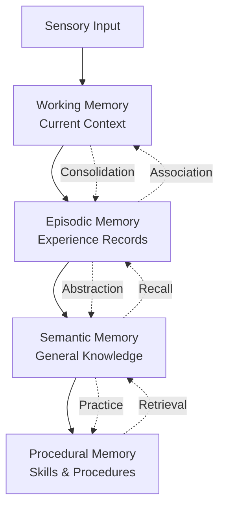

# :database: Memory System

Crablet implements a four-layer memory architecture inspired by cognitive psychology, providing persistent context across sessions.

-   :brain: **Four-Layer Memory**
    
    Working → Episodic → Semantic → Procedural
    
    ---
    
    [:octicons-arrow-right-24: Four-Layer Details](four-layer.md)

-   :twisted_rightwards_arrows: **Memory Fusion**
    
    Intelligent retrieval combining all memory layers
    
    ---
    
    [:octicons-arrow-right-24: Fusion Details](fusion.md)

## Architecture Overview

## Quick Facts

| Property | Value |
|:---------|:------|
| Memory layers | 4 (Working, Episodic, Semantic, Procedural) |
| Persistence | SQLite + optional Neo4j/Qdrant |
| Consolidation | Automatic (time + quantity triggered) |
| Retrieval | Fusion (multi-layer hybrid) |
| Thread safety | Arc&lt;RwLock&gt; throughout |
