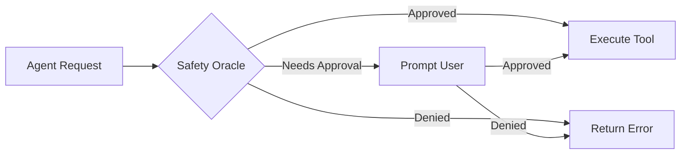

# :shield: Security

Crablet takes security seriously with a multi-layered approach to protect your system and data.

## Safety Oracle

The Safety Oracle validates all tool executions before they run:



### Validation Layers

1. **Command Validation** — Checks against allowed/blocked command lists
2. **Path Sandboxing** — Restricts file access to permitted directories
3. **Network Policies** — Controls outbound connections
4. **Resource Limits** — Enforces CPU, memory, and time constraints

## Access Control

### DM Pairing (Bot Mode)

When Crablet runs as a messaging bot, unknown users must be approved:

```
1. Unknown user sends message → Crablet generates 6-digit pairing code
2. Admin runs: crablet approve ABC123
3. User is added to whitelist with assigned role
```

### Role-Based Permissions

| Role | Permissions |
|:-----|:-----------|
| **Admin** | Full access, user management, config changes |
| **ReadWrite** | Chat, tool execution, file access |
| **ReadOnly** | Chat only, no tool execution |
| **ToolExecution** | Chat + approved tools |
| **AgentSpawn** | Can spawn sub-agents |
| **ConfigModify** | Can modify runtime configuration |

## Safety Levels

See [Configuration → Safety Levels](../getting-started/configuration.md#safety-levels) for detailed configuration.

## Best Practices

!!! danger "Production Checklist"
    - [ ] Set `safety.level = "Strict"`
    - [ ] Define explicit `allowed_commands`
    - [ ] Block dangerous commands: `rm -rf`, `mkfs`, `dd`
    - [ ] Restrict file paths to application directories
    - [ ] Enable audit logging
    - [ ] Rotate API keys regularly
